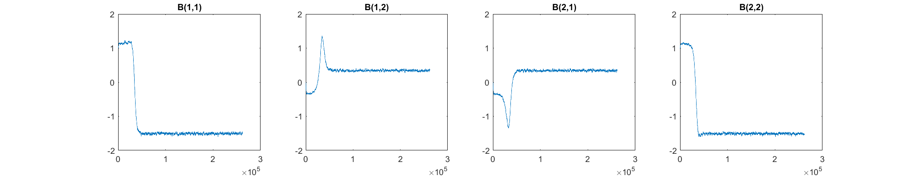

# Separating mixed images

<figure>
    
    <figcaption>Fig 1: source images</figcaption>
</figure>

<figure>
    
    <figcaption>Fig 2: mixed images</figcaption>
</figure>
<figure>
    
    <figcaption>Fig 3: result images - left image's <b>SNR</b> : 38.44 &amp; right image's <b>SNR</b> : 37.26</figcaption>
</figure>

<figure>
    
    <figcaption>Fig 4: plot elemants separating Matrix(B) by iteration</figcaption>
</figure>

